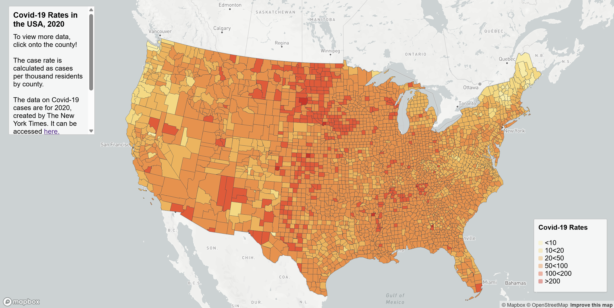

# Covid-19 Cases and Rates in the USA, 2020
This project includes 2 intereactive web browser maps. The first one is a choropleth map demonstrating the different  <ins> Rates </ins> of Covid-19 through each county in 2020. The second map is a proportional symbols map that demonstrates the different Covid-19 <ins>Cases</ins> through each county in 2020. The rate is determined by 

## Rates

To access the interactive map of Covid-19 <ins> Rates </ins> in the USA, 2020, please click the link [here.](https://nugaiyen.github.io/458p3--thematic-map/map2.html)
This is a choropleth map. You can click on each county to see the Covid-19 rate for 1,000 people, for that specific county, along side with the state, case counts, and death counts. The darker the county, the higher its rate. On the left side, you can find more information and scroll down as needed. To impliment this, I looked through the contents in [GEO 328, lab 4](https://github.com/jakobzhao/geog328/tree/main/labs/lab04).

Bellow is a preview of the map:

## Cases 
To access the interactive map of Covid-19 <ins>Cases</ins> in the USA, 2020, please click the link [here.](https://nugaiyen.github.io/458p3--thematic-map/map1.html) 
This is a proportional symbols. You can click dot see the Covid-19 cases. You will also find its corrosponding, state, county, and death counts. The darker and bigger the circle, the more cases the corosponding county has.

Bellow is a preview of the map:

## Data Sources and Acknowledgment 
The data for Covid-19 cases, and death in 2020 is from [The New Yourk Times](https://github.com/nytimes/covid-19-data/blob/43d32dde2f87bd4dafbb7d23f5d9e878124018b8/live/us-counties.csv). To create the rates, the totall population was collected through [2018 ACS 5 year estimates](https://data.census.gov/table/ACSDP5Y2018.DP05?g=0100000US$050000&d=ACS+5-Year+Estimates+Data+Profiles&hidePreview=true). The county shapefile that was used is from [the U.S. Census Bureau.](https://www.census.gov/geographies/mapping-files/time-series/geo/carto-boundary-file.html) The data set that was used in these interactive maps was processed by Steven Bao. 

